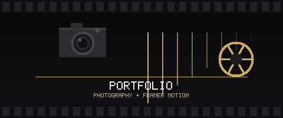

<div align="center">
  

  [](https://reactjs.org/)
  [](https://www.framer.com/motion/)
  [](https://styled-components.com/)

  **🎬 A dummy photographer portfolio built to master Framer Motion — page transitions, scroll animations, and smooth UX 🎞️**

</div>

---

## ✨ Features

- 🎬 **Page transitions** — smooth enter/exit animations on every route change
- 👁️ **Scroll-triggered animations** — elements animate in as they enter the viewport via `react-intersection-observer`
- 🎨 **styled-components** — CSS-in-JS with theme support
- 📱 **Responsive** — adapts from mobile to desktop
- 🗺️ **Multi-page** — Home, About, and individual project pages via React Router

## 🚀 Quick Start

```bash
npm install
npm start
```

Open `http://localhost:3000`.

## 🏗️ Build

```bash
npm run build
```

## 🛠️ Tech Stack

- **React 17**
- **Framer Motion v4** — animation library
- **styled-components v5** — component-scoped CSS
- **react-intersection-observer** — scroll-based animation triggers
- **React Router v5** — client-side navigation
- **Create React App**
